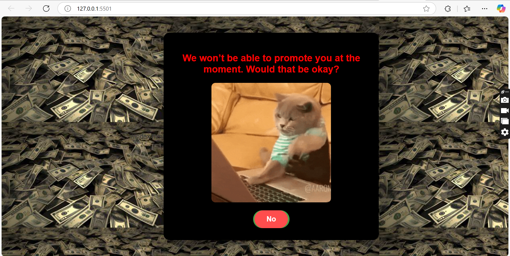
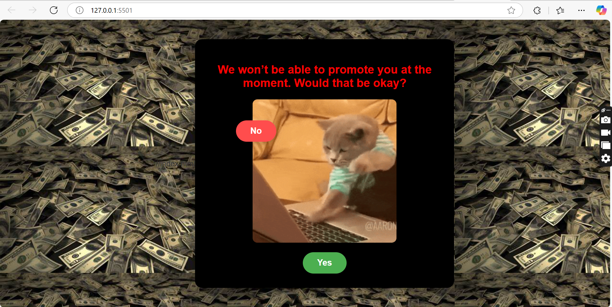
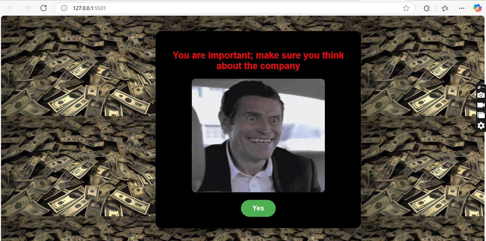

# Promotion Project

This is a simple project named **Promotion**, consisting of HTML, CSS, and JavaScript. My name is Talha Masood. I am software Engineer

## Table of Contents
- [Description](#description)
- [Installation](#installation)
- [How to Run the Project](#how-to-run-the-project)
- [Project Structure](#project-structure)
- [Technologies Used](#technologies-used)

## Description
The **Promotion** project is designed to demonstrate basic web development skills using **HTML**, **CSS**, and **JavaScript**. This project simulates a sarcastic promotional interaction. It presents users with a question asking, "Do you want a promotion?" The "Yes" option is selectable, while the "No" option is visible but cannot be selected or interacted with. This creates a playful and ironic experience, emphasizing the inevitability of selecting "Yes."


## Installation

Follow the steps below to clone this project to your local machine:

### 1. Clone the Repository
First, you need to clone the project repository from GitHub to your local machine. Use the following command in your terminal:

```bash
git clone https://github.com/TalhaMasood23/Promotion.git
Make sure to replace yourusername with your actual GitHub username.

2. Extract the Folder (if downloaded as ZIP)
If you've downloaded the project as a ZIP file from GitHub:

Go to the directory where the ZIP file is located.
Right-click on the ZIP file and select Extract All... (or use a similar option depending on your operating system).
Extract the files to a folder on your local machine.
3. Navigate to the Project Folder
Open your terminal (or command prompt) and navigate to the extracted project folder:

bash
Copy
cd path/to/your/folder/promotion
Make sure to replace path/to/your/folder with the actual directory path.

How to Run the Project
1. Open the Project in Your Browser
This project only requires a web browser. To run the project:

Open the folder where the project files are located.
Find and double-click the index.html file to open it in your default web browser.
You should now be able to see the webpage in your browser and interact with it.

HTML: index.html
CSS: styles.css
JavaScript: script.js
Once you've made your changes, refresh the page in the browser to see the updates.


The project folder contains the following structure:

├── index.html           # Main HTML file
├── styles.css           # CSS file for styling
├── script.js            # JavaScript file for interactivity
└── README.md            # This file


## ⭐️ Support & Stay Connected
If you found this project useful, please consider giving it a star and following me on GitHub to stay updated on future improvements!

Thanks for your support! 🚀

images:





